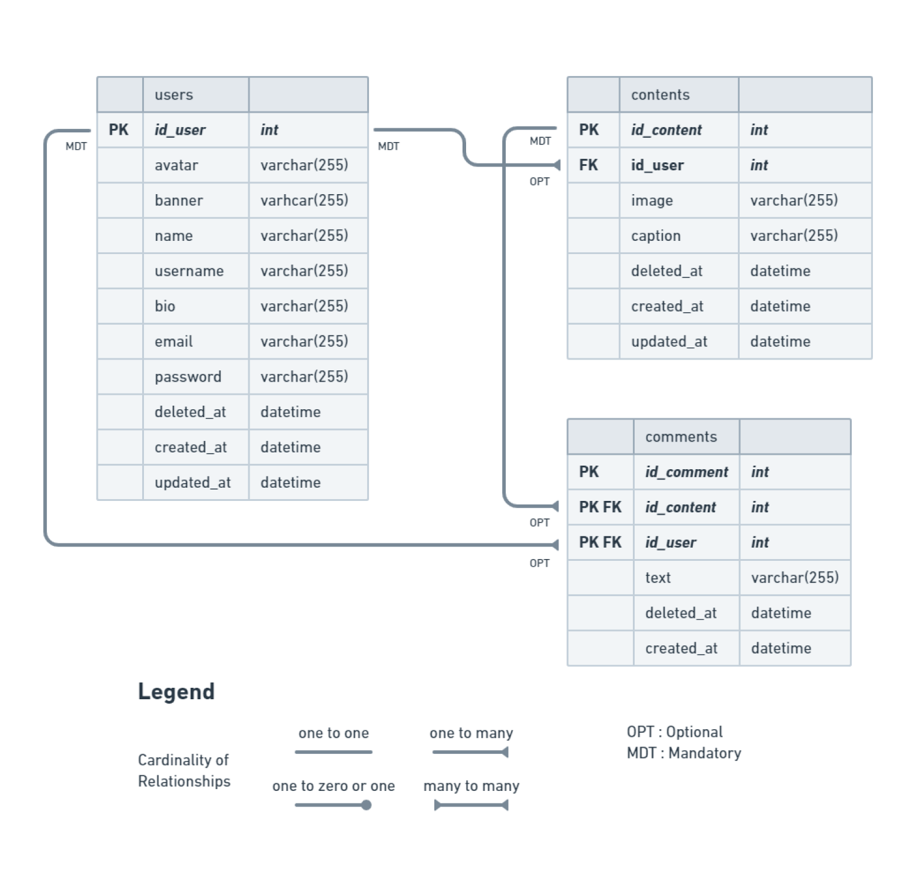

# 📑 Description

It's the backend system for our [social media app project](https://github.com/incredible-four/socialmedia-app) (FE Repository)

This RESTful API was developed by using Golang and written based on Clean Architecture principles. Built with Echo as web framework, GORM as ORM, MySQL as DBMS, etc.

# About the Project

1. User can register and login
2. User can update its profile (avatar, banner, name, username, email)
3. User can deactivate its own account
4. User can CRUD contents
5. User can CRUD comments on any content
6. and many more

# ⚡Features
- CRUD (Users, Contents, Comments)
- Hashing password
- Authentication & Authorization
- Database Migration
- Automated deployment with GitHub Actions, DockerHub & AWS EC2

# 🔥 Open API

Simply [click here](https://app.swaggerhub.com/apis-docs/ALIFMUHAMADHAFIDZ23/SocialMedia-Group4/1.0.0) to see the details of endpoints we have agreed on.

<details>
  <summary>👶 Users</summary>
  
| Method      | Endpoint            | Params      | JWT Token   | Function                                |
| ----------- | ------------------- | ----------- | ----------- | --------------------------------------- |
| POST        | /register           | -           | NO          | Register a new user                     |
| POST        | /login              | -           | NO          | Login to the system                     |
| GET         | /users/{username}   | username    | NO          | Show profile (get user & its contents)  |
| GET         | /users              | -           | YES         | Get data user (for edit profile form)   |
| PUT         | /users              | -           | YES         | Update user profile                     |
| DELETE      | /users              | -           | YES         | Deactivate user account                 |
  
</details>

<details>
  <summary>🔖 Contents</summary>
  
| Method      | Endpoint                | Params      | JWT Token   | Function                                |
| ----------- | ----------------------- | ----------- | ----------- | --------------------------------------- |
| GET         | /contents               | -           | NO          | Get all contents                        |
| GET         | /contents/{id_content}  | id_content  | NO          | Get a content by its ID                 |
| POST        | /contents               | -           | YES         | Post a new content                      |
| PUT         | /contents/{id_content}  | id_content  | YES         | Update a content                        |
| DELETE      | /contents/{id_content}  | id_content  | YES         | Delete a content                        |
  
</details>

<details>
  <summary>🗨️ Comments</summary>
  
| Method      | Endpoint                | Params      | JWT Token   | Function                                |
| ----------- | ----------------------- | ----------- | ----------- | --------------------------------------- |
| POST        | /comments/{id_content}  | id_content  | YES         | Post a new comment                      |
| DELETE      | /comments/{id_comment}  | id_comment  | YES         | Delete a comment                        |
  
</details>


# 🔗 ERD


# 💻 Built with

- [Golang](https://go.dev/) : Programming Language
- [Viper](https://github.com/spf13/viper) : Environment Reader
- [Echo](https://echo.labstack.com/) : Web Framework
- [JWT](https://jwt.io/) : Authentication & Authorization
- [GORM](https://gorm.io/) : ORM Library
- [MySQL](https://gorm.io/) : Database Management System
- [Docker](https://docker.com/) : Containerization
- [Amazon EC2](https://aws.amazon.com/) : Cloud server
- [Cloudinary](https://cloudinary.com/) : Store and retrieve images

# 🛠️ Installation Steps

- Clone it

```
$ git clone https://github.com/incredible-four/socialmedia-api/
```

- Go to directory

```
$ cd socialmedia-api
```

- Create a new database

- Rename `local.env.example` to `local.env`
- Rename `cloud.env.example` to `cloud.env`
- Adjust `local.env` & `cloud.env`as your environment settings

- Run the project

```
$ go run .
```

# 🤖 Author

- Alif Muhamad Hafidz :

    <a target="_blank" href="https://github.com/AlifMuhamadHafidz"></a>&ensp;

- Muhammad Habibullah :

    <a target="_blank" href="https://github.com/hebobibun"></a>&ensp;


