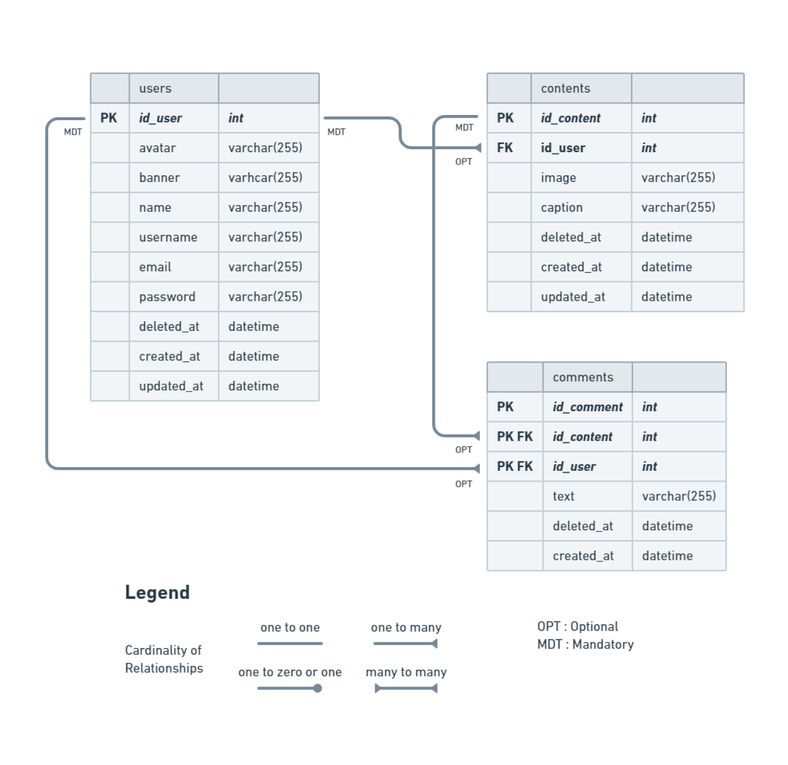

# Description

It's the backend system for our [social media app project](https://github.com/incredible-four/socialmedia-app). User can post contents and comment on other's posts. This REST API was developed by using Golang and written based on Clean Architecture principles with Echo as web framework, GORM as ORM, MySQL as DBMS, etc.

# ⚡Features
- CRUD (Users, Contents, Comments)
- Hashing password
- Authentication & Authorization
- Database Migration
- Automated deployment with GitHub Actions, DockerHub & AWS EC2

# 🔥 Open API

Here's the list of endpoints we have agreed on :

  
👶 Users

  
| Method      | Endpoint            | Params      | JWT Token   | Function                                |
| ----------- | ------------------- | ----------- | ----------- | --------------------------------------- |
| POST        | /register           | -           | NO          | Register a new user                     |
| POST        | /login              | -           | NO          | Login to the system                     |
| GET         | /users/{username}   | username    | NO          | Show profile (get user & its contents)  |
| GET         | /users              | -           | YES         | Get data user (for edit profile form)   |
| PUT         | /users              | -           | YES         | Update user profile                     |
| DELETE      | /users              | -           | YES         | Deactivate user account                 |
  

  
🔖 Contents

  
| Method      | Endpoint                | Params      | JWT Token   | Function                                |
| ----------- | ----------------------- | ----------- | ----------- | --------------------------------------- |
| GET         | /contents               | -           | NO          | Get all contents                        |
| GET         | /contents/{id_content}  | id_content  | NO          | Get a content by its ID                 |
| POST        | /contents               | -           | YES         | Post a new content                      |
| PUT         | /contents/{id_content}  | id_content  | YES         | Update a content                        |
| DELETE      | /contents/{id_content}  | id_content  | YES         | Delete a content                        |
  

  
🗨️ Comments

  
| Method      | Endpoint                | Params      | JWT Token   | Function                                |
| ----------- | ----------------------- | ----------- | ----------- | --------------------------------------- |
| POST        | /comments/{id_content}  | id_content  | YES         | Post a new comment                      |
| DELETE      | /comments/{id_comment}  | id_comment  | YES         | Delete a comment                        |
  

# 🔗 ERD

# 💻 Built with

- [Golang](https://go.dev/) : Programming Language
- [Viper](https://github.com/spf13/viper) : Environment Reader
- [Echo](https://echo.labstack.com/) : Web Framework
- [JWT](https://jwt.io/) : Authentication & Authorization
- [GORM](https://gorm.io/) : ORM Library
- [MySQL](https://gorm.io/) : Database Management System
- [Docker](https://docker.com/) : Containerization
- [Amazon EC2](https://aws.amazon.com/) : Cloud Server
- [Amazon S3](https://aws.amazon.com/) : Store and retrieve objects

# 🛠️ Installation Steps

[ Available soon ]

# 👑 Author

- [Alif Muhamad Hafidz](https://github.com/AlifMuhamadHafidz)
- [Muhammad Habibullah](https://github.com/hebobibun)

